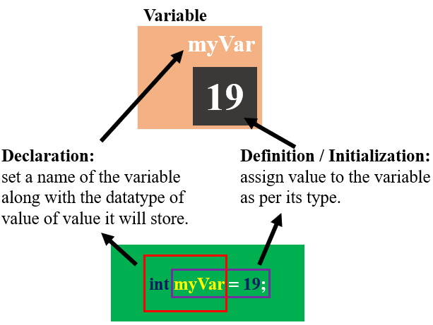
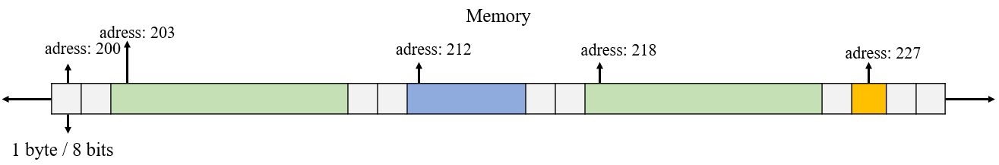
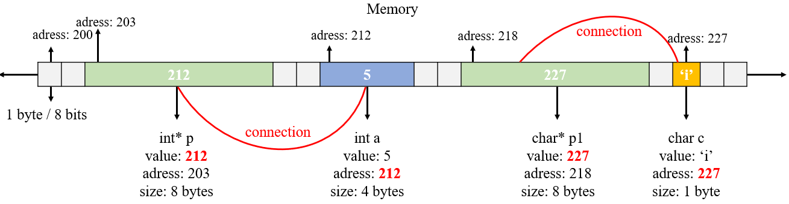
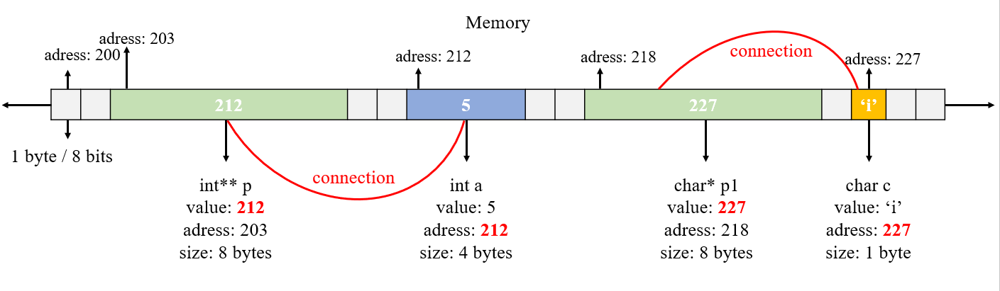

# **Pointers**

### **Pointers in a nutshell**

In C/C++ programming, a pointer is a **variable that stores the memory address of another variable or memory location**, and they can be used to indirectly access the stored data.

1. Pointers are declared by placing an asterisk "**`*`**" in front of the variable name.
2. The "**`&`**" operator is used to `get the memory address` of a variable.
3. The "**`*`**" operator is used to indirectly `access the value` stored at a memory address.
4. Pointers can be used to efficiently pass large amounts of data to functions and to manipulate dynamic data structures such as linked lists and trees.

```c
int a; // integer
int* pointer_of_a; // pointer to integer

char c; // character
char* pointer_of_c; // pointer to character

double d; // real number
double* pointer_of_d; // pointer to real number

pointer_of_a = &a; // &a is equal to memory adress of a
...
pointer_of_d = &d; // &d is equal to memory adress of d

// prints the memory adress where pointer_of_a points
printf("%d\n", pointer_of_a);

// prints the value, stored in the memory where pointer_of_a points
printf("%d\n", *pointer_of_a); // dereferencing

// prints the memory adress of a
printf("%d\n", &a); // &a = adress of a
```

### **Size of data types**

The **size** of **data types** in computer memory can vary depending on the specific data type and the computer's architecture. In general, though, most data types have a **fixed size** that is determined by the programming language and the computer's hardware. For example, a **float data type** (*used to represent floating-point numbers / real numbers*) typically takes up **4 bytes** of memory on a **32-bit system**, while a **double data type** (*used to represent double-precision floating-point numbers / real numbers*) typically takes up **8 bytes** of memory on a 64-bit system.

You can get the size of a data type or variable by using the built-in function `sizeof()`.

```c
int size_of_int = sizeof(int); // 4 bytes
int size_of_char = sizeof(char); // 1 byte
int size_of_float = sizeof(float); // 4 bytes 
int size_of_double = sizeof(double); // 8 bytes

// note that all types of pointers are 8 bytes
int size_of_pointer = sizeof(*int); // bytes
```
### **Creating a variable in general** (help for upcoming descriptions)

<p align="center" width="100%">
    
</p>

1. Variable declaration in C tells the compiler about the existence of the variable with the given name and data type.
   
2. Initialization of a variable is the process where the user assigns some meaningful value to the variable.


### **Behind the scenes**
What really happens if you run this code?

```c
// declaration
int a; 
int* p; // pointer of a 
char c; 
char* p1; // pointer of c

// initialization / definition
a = 5; // assigning a value 5
p = &a; // assigning p value adress of a
c = 'i'; // assigning c value 'i'
p1 = &c; // assigning p1 value adress of c
```

### **Compiler allocates memory for all the variables created**
<p align="center" width="100%">
    
</p>

### **Compiler Assigning values**
<p align="center" width="100%">
    
</p>

<p align="center" width="100%">
    
</p>


### **What is pointer arithmetic?**

A pointer in C is an address, which is a **numeric value**. Therefore, you can perform arithmetic operations on a pointer just as you can on a numeric value. \
When a pointer is incremented, it actually **increments by the number equal to the size of the data type** for which it is a pointer.
### <center>**`!!!`**</center>
For Example: If an **integer pointer** that stores address 212 is incremented, then it will increment by 4 (size of an int) and the new address it will point to is 216.\
\
If a **character pointer** that stores address 227 is incremented, then it will increment by 1 (size of a char) and the new address it will point to becomes 228.


```c
printf("Adresss of a is %d\n", p); //  212
printf("Size of integer is %d bytes\n", sizeof(int)); // 4
printf("Adress p+1 is %d\n", p + 1); // p+1 is 216

printf("Adresss of c is %d\n", p); //  227
printf("Size of character is %d byte(s)\n", sizeof(char)); // 1
printf("Adress p1+1 is %d\n", p + 1); // p1+1 is 228

```
\
**Representation of 4 bytes of memory that stores an integer variable**


```c
int a = 1025;
int* p = &a;

printf("Size of integer is %d bytes\n", sizeof(int));
// Size of integer is 4 bytes

printf("Address of a = %d, value of a = %d\n", p, *p);
// Address of a = 200, value of a = 1025
```

### **About type casting**
Type casting is basically a process in C in which we change a variable belonging to one data type to another one. In type casting, the compiler automatically changes one data type to another one depending on what we want the program to do.
```c
// the code written above is included

char *p0;
p0 = (char*)p; // type casting

printf("Size of char is %d bytes\n", sizeof(char));
printf("Address of a = %d, value of a = %d\n", p0, *p0);

/*

p  = 00000000 00000000 00000100 00000001 which is 1025 in decimal
p0 = 00000001 which is 1 in decimal

1025 = 00000000 00000000 00000100 00000001 - 4 bytes, 32 bits

value of *p0 equals 1, because character type stores 1 byte of memory
and the first and only byte of pointer p0 is 00000001, which represents the value 1 in binary

*/
```
**The reason why the value of *p0 equals 1:**\
When we created **integer variable `a`**, the compiler allocated **4 bytes of consecutive memory** for it. We also created an **integer type pointer variable `p`**, which stored the first byte of those **4 bytes**.
On the other hand, we declared a **character type pointer `p0`**, which was initialized with the value pointer `p`, type casted to character type. That means, this character pointer expects that only **1 byte** stores the actual value on the memory location it has been initialized, so it neglects the last 3 bytes of integer `a`. 

### **Pointer to pointer**

In C programming, a pointer to a pointer is a type of variable that stores the address of another pointer variable. This can be useful when we want to pass a pointer to a function as an argument, or when we want to store a pointer in another data structure, such as an array.

```c
int x = 5;
int* p = &x;
int** q = &p;
```

<p align="center" width="100%">
    
</p>