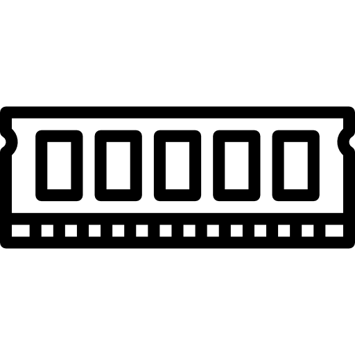
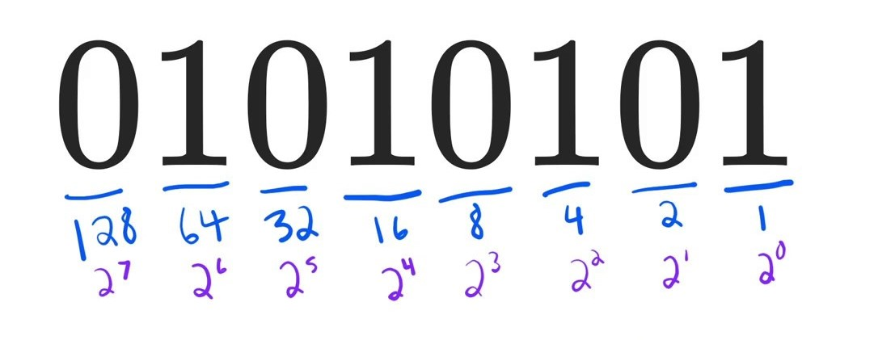
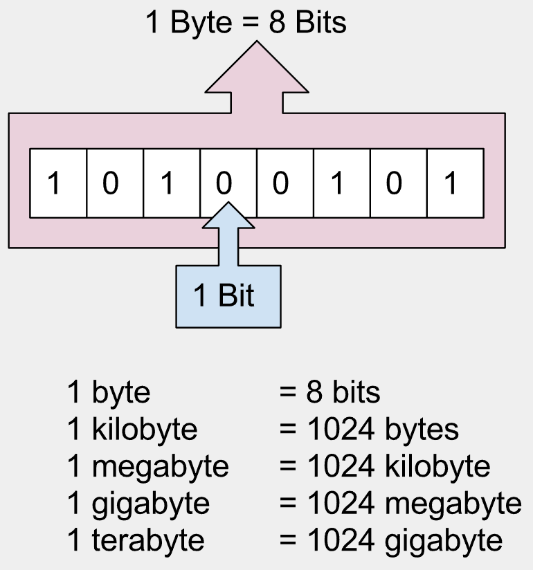

# Understanding computer memory

Memory of a computer is any physical device that is capable of storing information whether it is large or small, and stores it temporarily (such as RAMs) or permanently (such as SSDs). 

\
Memory can be either volatile or non-volatile. Volatile memory is a type of memory that loses its contents when the computer or hardware device is switched off. On the other hand, non-volatile storage is a type of computer memory that can retain stored information even after power is removed.

# The language of computers

**Binary code** is how computers talk and represent information. Letters, numbers, and pictures…. basically everything you see on the computer (including this post) is made up of different combinations of **0's and 1's**. Binary numbers are **base 2 numbers**, and have only two values – 0 and 1. If we look at a binary number like 01010101, it's decimal form would be:
 (0 * 27) + (1 * 26) + (0 * 25) + (1 * 24) + (0 * 23) + (1 * 22) + (0 * 21) + (1 * 20) \
= 64 + 16 + 4 + 1 = `85` 

 

    

# Units of memory

 
 
A computer processor is made up of multiple decisive circuits, each one of which may be either OFF or ON. These two states in terms of memory are represented by a 0 or 1. In order to count higher than 1, such bits (binary digits) are suspended together. A group of **eight bits** is known as a **byte**.
**1 byte can represent numbers between zero (00000000) and 255 (11111111), or 28 = 256 distinct positions**. Of course, these bytes may also be combined to represent larger numbers. The computer represents all characters and numbers internally in the same fashion.
